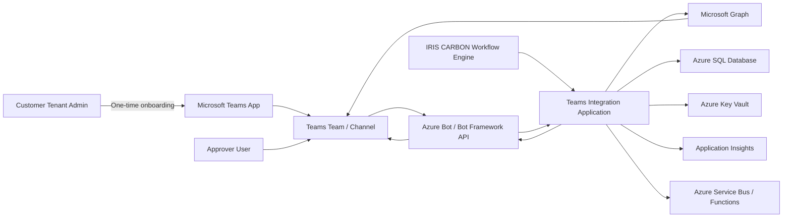
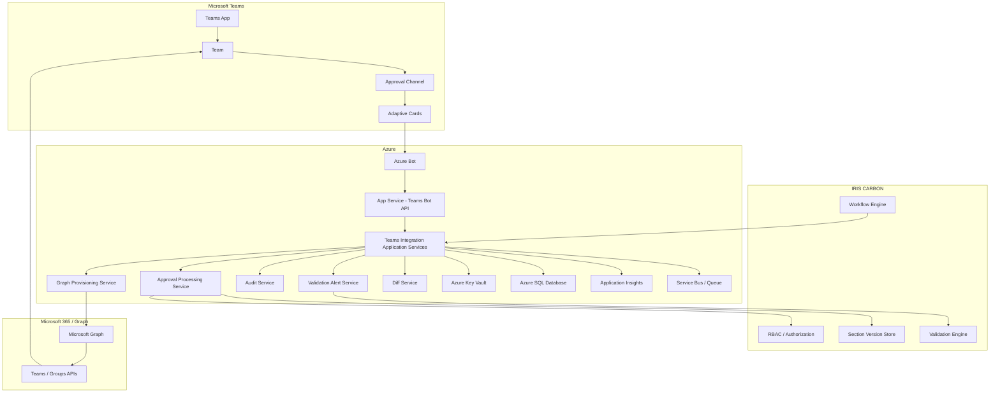
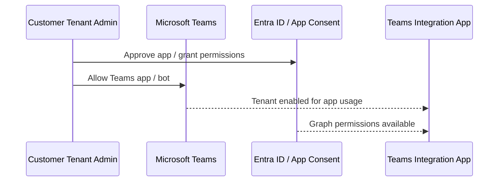
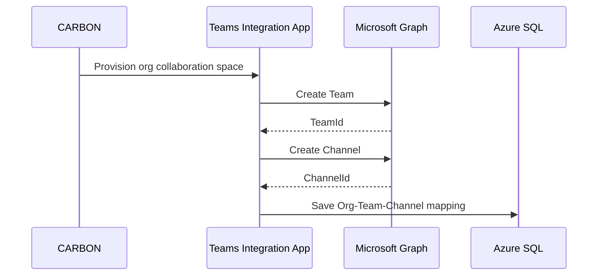
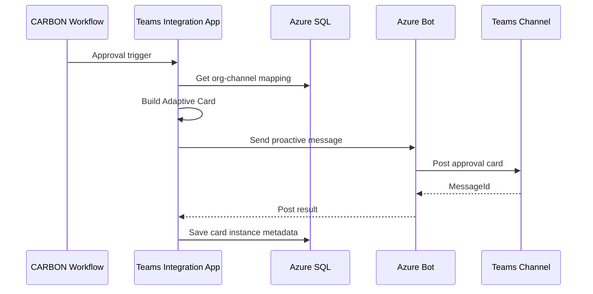
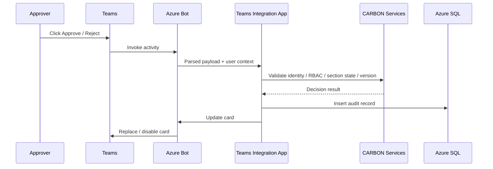
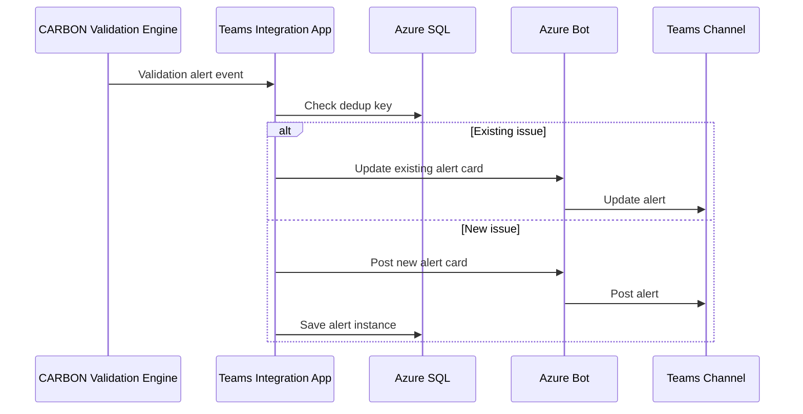

# Technical Design Document  
## Microsoft Teams App + Bot + Graph Integration for IRIS CARBON  
### C# and Azure Design for Automated Enterprise Approval Workflow

**Document Version:** 1.0  
**Prepared For:** Engineering / Architecture / Product Management  
**Prepared By:** Dhiraj Suryawanshi
**Date:** 2026-04-14  

---

## Table of Contents

1. [Purpose](#1-purpose)  
2. [Scope](#2-scope)  
3. [Solution Overview](#3-solution-overview)  
4. [Architecture Overview](#4-architecture-overview)  
5. [Architecture Diagram](#5-architecture-diagram)  
6. [End-to-End Runtime Flows](#6-end-to-end-runtime-flows)  
   - [6.1 One-Time Admin Onboarding Flow](#61-one-time-admin-onboarding-flow)  
   - [6.2 Automated Team and Channel Provisioning Flow](#62-automated-team-and-channel-provisioning-flow)  
   - [6.3 Approval Card Posting Flow](#63-approval-card-posting-flow)  
   - [6.4 Approve / Reject Callback Flow](#64-approve--reject-callback-flow)  
   - [6.5 Validation Alert Flow](#65-validation-alert-flow)  
7. [Azure Resource Design](#7-azure-resource-design)  
8. [Application Architecture](#8-application-architecture)  
9. [API Design](#9-api-design)  
10. [Database Schema Design](#10-database-schema-design)  
11. [C# Solution Structure](#11-c-solution-structure)  
12. [C# Service and Class Design](#12-c-service-and-class-design)  
13. [Adaptive Card Design](#13-adaptive-card-design)  
14. [Identity, Authorization, and Security Design](#14-identity-authorization-and-security-design)  
15. [Audit Logging Design](#15-audit-logging-design)  
16. [Error Handling and Retry Strategy](#16-error-handling-and-retry-strategy)  
17. [Monitoring and Observability](#17-monitoring-and-observability)  
18. [Deployment Design](#18-deployment-design)  
19. [Future Enhancements](#19-future-enhancements)  

---

## 1. Purpose

This document provides the technical design for implementing a Microsoft Teams-based approval workflow for IRIS CARBON using:

- Microsoft Teams App
- Bot Framework
- Microsoft Graph
- C#
- Azure

The target operating model is:

- one-time customer admin onboarding
- full backend automation after onboarding
- Teams used as the collaboration and approval interaction surface
- CARBON retained as the system of record for workflow, RBAC, validation, and audit

---

## 2. Scope

This design covers:

- Azure architecture
- C# service architecture
- Teams app and bot integration
- Microsoft Graph-based Team and Channel provisioning
- approval card generation and callback processing
- audit logging
- stale-card handling
- diff digest support
- validation alert support

This design does **not** cover:
- front-end UI inside CARBON beyond API integration
- customer billing / tenant commercial onboarding
- advanced reporting UI for audit analytics

---

## 3. Solution Overview

The solution is based on the following principles:

1. **Customer admin performs one-time onboarding**
2. **Graph provisions and manages Team/Channel structures**
3. **Bot posts and updates Adaptive Cards**
4. **CARBON validates every approval action**
5. **All Teams-originated actions are audit logged**
6. **No workflow state is trusted unless validated server-side**

### Core Functional Capabilities

- create or link Teams Team automatically
- create workflow channel automatically
- map CARBON organization to Teams channel
- post approval cards when section enters `PENDING_APPROVAL`
- process Approve/Reject actions
- validate Entra identity and CARBON RBAC
- prevent stale approvals
- write immutable audit trail
- post validation alerts and deduplicate updates

---

## 4. Architecture Overview

The solution has five major layers:

1. **Microsoft Teams Layer**
   - Teams app
   - channel installation context
   - user interaction through Adaptive Cards

2. **Bot Interaction Layer**
   - Bot Framework activity endpoint
   - proactive message posting
   - card action handling
   - card update logic

3. **Application Layer**
   - approval orchestration
   - validation alert orchestration
   - stale-card logic
   - audit orchestration
   - provisioning orchestration

4. **Integration Layer**
   - Graph API integration
   - Key Vault integration
   - storage/repository integration
   - queue integration

5. **Persistence and Monitoring Layer**
   - Azure SQL
   - Application Insights
   - optional Service Bus
   - optional Storage/Blob archive

---

## 5. Architecture Diagram

### 5.1 High-Level Architecture



### 5.2 Detailed Component View



---

## 6. End-to-End Runtime Flows

## 6.1 One-Time Admin Onboarding Flow

1. Customer admin approves Teams app in tenant
2. Customer admin permits bot/app usage in Teams
3. Customer admin grants Graph permissions required for provisioning
4. Teams app becomes available in tenant
5. Integration is ready for automated provisioning and posting



## 6.2 Automated Team and Channel Provisioning Flow

1. CARBON provisioning event is triggered
2. Teams Integration Application calls Graph
3. Graph creates Team if needed
4. Graph creates Channel if needed
5. application stores Team/Channel mapping in SQL
6. bot/channel is ready for posting



## 6.3 Approval Card Posting Flow

1. section enters `PENDING_APPROVAL`
2. CARBON sends approval trigger
3. application resolves org-channel mapping
4. card payload is built
5. bot posts proactive card
6. card instance metadata is persisted



## 6.4 Approve / Reject Callback Flow

1. user clicks Approve or Reject
2. Teams sends invoke activity to bot
3. bot parses payload and user context
4. application validates identity, RBAC, state, version
5. application writes audit
6. application updates Teams card



## 6.5 Validation Alert Flow

1. CARBON validation engine produces issue
2. application receives alert trigger
3. deduplication key is checked
4. existing card updated or new card created
5. issue resolution updates card later



---

## 7. Azure Resource Design

| Resource | Purpose |
|---|---|
| Azure App Service | Hosts bot/API application |
| Azure Bot | Registers bot and Teams channel integration |
| Azure Entra App Registration | Bot and Graph app identity |
| Azure SQL Database | Stores mappings, cards, audits, alerts |
| Azure Key Vault | Stores secrets/certificates |
| Application Insights | Logs, traces, metrics |
| Azure Service Bus | Optional async event handling |
| Azure Functions | Optional background cleanup/retry jobs |

### 7.1 Recommended Environment Separation

- Dev
- QA / UAT
- Production

Each environment should have:
- separate app registration where appropriate
- separate App Service
- separate SQL database
- separate Key Vault
- separate Application Insights instance

---

## 8. Application Architecture

### 8.1 Layered Architecture

- **Presentation Layer**
  - Bot controllers
  - internal provisioning/trigger APIs

- **Application Layer**
  - use cases
  - orchestration services
  - validators

- **Domain Layer**
  - entities
  - enums
  - business rules

- **Infrastructure Layer**
  - EF Core repositories
  - Graph clients
  - bot adapters
  - Key Vault providers
  - queue publishers

### 8.2 Bounded Functional Areas

- Provisioning
- Messaging
- Approval Actions
- Audit
- Validation Alerts
- Diff
- Security / Identity

---

## 9. API Design

## 9.1 Provisioning APIs

### POST `/api/teams/provision/team`

Creates a Team for a CARBON organization.

**Request**
```json
{
  "orgId": "ORG-1001",
  "teamDisplayName": "Carbon - Acme Corp",
  "teamDescription": "Disclosure collaboration team for Acme Corp",
  "owners": ["owner1@contoso.com"],
  "members": ["user1@contoso.com", "user2@contoso.com"]
}
```

**Response**
```json
{
  "orgId": "ORG-1001",
  "teamId": "19:abc123@thread.tacv2",
  "status": "Created"
}
```

---

### POST `/api/teams/provision/channel`

Creates a Channel inside an existing Team.

**Request**
```json
{
  "orgId": "ORG-1001",
  "teamId": "19:abc123@thread.tacv2",
  "channelName": "carbon-approvals",
  "description": "Approval workflow channel"
}
```

**Response**
```json
{
  "orgId": "ORG-1001",
  "teamId": "19:abc123@thread.tacv2",
  "channelId": "19:def456@thread.tacv2",
  "status": "Created"
}
```

---

### POST `/api/teams/channels`

Creates or updates org-to-channel mapping.

**Request**
```json
{
  "orgId": "ORG-1001",
  "teamId": "19:abc123@thread.tacv2",
  "channelId": "19:def456@thread.tacv2",
  "tenantId": "tenant-guid"
}
```

**Response**
```json
{
  "orgId": "ORG-1001",
  "status": "Mapped"
}
```

---

### DELETE `/api/teams/channels/{orgId}`

Deactivates org-to-channel mapping.

---

## 9.2 Approval APIs

### POST `/api/teams/cards/approval`

Triggers approval card posting.

**Request**
```json
{
  "orgId": "ORG-1001",
  "sectionId": "SEC-5001",
  "documentId": "DOC-2001",
  "documentVersion": "v12",
  "sectionName": "Liquidity and Capital Resources",
  "lastEditor": "Jane Doe",
  "lastEditedUtc": "2026-04-14T10:30:00Z",
  "workflowState": "PENDING_APPROVAL",
  "sectionVersionHash": "sha256-xyz",
  "lastModifiedUtc": "2026-04-14T10:30:00Z"
}
```

**Response**
```json
{
  "cardInstanceId": "card-guid",
  "status": "Posted"
}
```

---

## 9.3 Validation Alert APIs

### POST `/api/teams/cards/validation-alert`

Creates or updates validation alert card.

**Request**
```json
{
  "orgId": "ORG-1001",
  "sectionId": "SEC-5001",
  "documentId": "DOC-2001",
  "issueType": "TOTALS_MISMATCH",
  "severity": "High",
  "issueKey": "SEC-5001:TOTALS_MISMATCH:Revenue",
  "description": "Revenue total does not match detail rows."
}
```

---

## 9.4 Audit APIs

### GET `/api/audit/approvals`

Supports filtering and paging.

**Query parameters**
- orgId
- sectionId
- documentId
- approverUserId
- fromUtc
- toUtc
- page
- pageSize

### GET `/api/audit/{id}/verify`

Recomputes and verifies integrity hash.

---

## 10. Database Schema Design

## 10.1 OrganizationTeamsChannelMapping

| Column | Type | Notes |
|---|---|---|
| Id | uniqueidentifier | PK |
| OrgId | nvarchar(100) | Unique active org mapping |
| TeamId | nvarchar(200) | Teams Team ID |
| ChannelId | nvarchar(200) | Teams Channel ID |
| TenantId | nvarchar(100) | Entra tenant |
| ConversationId | nvarchar(300) | For proactive posting |
| ServiceUrl | nvarchar(500) | Bot service URL |
| IsActive | bit | Active mapping flag |
| CreatedUtc | datetime2 | |
| UpdatedUtc | datetime2 | |

**Indexes**
- unique filtered index on `(OrgId)` where `IsActive = 1`
- index on `(TenantId, TeamId, ChannelId)`

---

## 10.2 ProvisionedTeams

| Column | Type | Notes |
|---|---|---|
| Id | uniqueidentifier | PK |
| OrgId | nvarchar(100) | |
| TeamId | nvarchar(200) | |
| TeamDisplayName | nvarchar(200) | |
| TenantId | nvarchar(100) | |
| ProvisioningStatus | nvarchar(50) | Created / Failed / Pending |
| CreatedUtc | datetime2 | |
| UpdatedUtc | datetime2 | |

---

## 10.3 ProvisionedChannels

| Column | Type | Notes |
|---|---|---|
| Id | uniqueidentifier | PK |
| OrgId | nvarchar(100) | |
| TeamId | nvarchar(200) | |
| ChannelId | nvarchar(200) | |
| ChannelName | nvarchar(200) | |
| TenantId | nvarchar(100) | |
| IsDefaultApprovalChannel | bit | |
| CreatedUtc | datetime2 | |
| UpdatedUtc | datetime2 | |

---

## 10.4 ApprovalCardInstances

| Column | Type | Notes |
|---|---|---|
| CardInstanceId | uniqueidentifier | PK |
| OrgId | nvarchar(100) | |
| SectionId | nvarchar(100) | |
| DocumentId | nvarchar(100) | |
| DocumentVersion | nvarchar(50) | |
| TeamId | nvarchar(200) | |
| ChannelId | nvarchar(200) | |
| ConversationId | nvarchar(300) | |
| TeamsMessageId | nvarchar(200) | |
| SectionVersionHash | nvarchar(256) | |
| IssuedAtUtc | datetime2 | |
| Status | nvarchar(50) | Active / Approved / Rejected / Stale / Superseded / Expired |
| SupersededByCardInstanceId | uniqueidentifier | Nullable |
| LastUpdatedUtc | datetime2 | |

**Indexes**
- `(OrgId, SectionId, Status)`
- `(TeamsMessageId)`
- `(SectionId, IssuedAtUtc desc)`

---

## 10.5 ApprovalAuditRecords

| Column | Type | Notes |
|---|---|---|
| Id | uniqueidentifier | PK |
| ApproverUserId | nvarchar(100) | Entra object ID or mapped user ID |
| DisplayName | nvarchar(200) | |
| TenantId | nvarchar(100) | |
| ServerTimestampUtc | datetime2 | |
| Decision | nvarchar(50) | Approve / Reject / Refresh / ExceptionAccepted |
| RejectReason | nvarchar(max) | Nullable |
| ApproveComment | nvarchar(max) | Nullable |
| SectionId | nvarchar(100) | |
| DocumentId | nvarchar(100) | |
| DocumentVersion | nvarchar(50) | |
| SectionVersionHash | nvarchar(256) | |
| PreviousState | nvarchar(50) | |
| NewState | nvarchar(50) | |
| SourceChannel | nvarchar(50) | Teams |
| CorrelationId | nvarchar(100) | |
| TeamsConversationId | nvarchar(300) | |
| TeamsMessageId | nvarchar(200) | |
| CardInstanceId | uniqueidentifier | |
| IntegrityHash | nvarchar(256) | |
| CreatedUtc | datetime2 | |

**Indexes**
- `(SectionId, CreatedUtc desc)`
- `(DocumentId, CreatedUtc desc)`
- `(ApproverUserId, CreatedUtc desc)`
- `(CorrelationId)`

---

## 10.6 ValidationAlertInstances

| Column | Type | Notes |
|---|---|---|
| AlertInstanceId | uniqueidentifier | PK |
| OrgId | nvarchar(100) | |
| SectionId | nvarchar(100) | Nullable |
| DocumentId | nvarchar(100) | |
| IssueType | nvarchar(100) | |
| Severity | nvarchar(50) | |
| IssueKey | nvarchar(300) | Dedup key |
| Description | nvarchar(max) | |
| TeamId | nvarchar(200) | |
| ChannelId | nvarchar(200) | |
| ConversationId | nvarchar(300) | |
| TeamsMessageId | nvarchar(200) | |
| Status | nvarchar(50) | Active / Resolved / AcceptedException |
| LastUpdatedUtc | datetime2 | |
| CreatedUtc | datetime2 | |

**Indexes**
- unique index on `(OrgId, IssueKey, Status)` for active issues if desired
- `(DocumentId, LastUpdatedUtc desc)`

---

## 11. C# Solution Structure

```text
Carbon.Teams.sln
 ├── Carbon.Teams.Bot
 ├── Carbon.Teams.Api
 ├── Carbon.Teams.Application
 ├── Carbon.Teams.Domain
 ├── Carbon.Teams.Infrastructure
 ├── Carbon.Teams.Contracts
 └── Carbon.Teams.Tests
```

### 11.1 Project Responsibilities

#### Carbon.Teams.Bot
- Bot activity handlers
- Teams invoke processing
- proactive messaging integration

#### Carbon.Teams.Api
- internal provisioning APIs
- approval trigger APIs
- validation alert APIs
- audit query APIs

#### Carbon.Teams.Application
- use cases
- orchestration
- workflow validation
- stale-card rules
- audit creation logic

#### Carbon.Teams.Domain
- entities
- value objects
- enums
- business rules

#### Carbon.Teams.Infrastructure
- EF Core repositories
- Graph client wrappers
- bot client services
- Key Vault adapters
- hash generation
- queue adapters

#### Carbon.Teams.Contracts
- DTOs
- request/response models
- integration contracts

---

## 12. C# Service and Class Design

## 12.1 Core Application Services

### `ITeamsProvisioningService`
Responsible for provisioning Team and Channel structures.

**Methods**
- `Task<TeamProvisionResult> CreateTeamAsync(CreateTeamRequest request)`
- `Task<ChannelProvisionResult> CreateChannelAsync(CreateChannelRequest request)`
- `Task<OrgChannelMappingResult> MapOrganizationChannelAsync(MapOrgChannelRequest request)`

---

### `IGraphTeamsProvisioningService`
Wrapper over Microsoft Graph operations.

**Methods**
- `Task<string> CreateTeamAsync(GraphCreateTeamRequest request)`
- `Task<string> CreateChannelAsync(GraphCreateChannelRequest request)`
- `Task AddMembersAsync(GraphAddMembersRequest request)`

---

### `IApprovalCardPostingService`
Responsible for approval card creation and proactive posting.

**Methods**
- `Task<CardPostResult> PostApprovalCardAsync(PostApprovalCardRequest request)`
- `Task<CardUpdateResult> UpdateApprovalCardAsync(UpdateApprovalCardRequest request)`
- `Task<CardUpdateResult> MarkCardStaleAsync(Guid cardInstanceId)`
- `Task<CardUpdateResult> MarkCardSupersededAsync(Guid cardInstanceId, Guid supersededByCardInstanceId)`

---

### `IApprovalActionService`
Responsible for approval/reject action orchestration.

**Methods**
- `Task<ApprovalActionResult> HandleApprovalActionAsync(ApprovalActionCommand command)`

This service should coordinate:
- identity validation
- RBAC
- state validation
- stale-card check
- audit creation
- message update

---

### `IIdentityValidationService`
Responsible for validating Teams/Entra identity context.

**Methods**
- `Task<UserIdentityContext> ValidateAndResolveIdentityAsync(TeamsActionContext context)`

---

### `IAuthorizationService`
Responsible for CARBON authorization.

**Methods**
- `Task<AuthorizationResult> CanApproveSectionAsync(string userId, string orgId, string sectionId)`

---

### `IStaleCardValidationService`
Responsible for stale-card checks.

**Methods**
- `Task<StaleValidationResult> ValidateAsync(ApprovalCardValidationRequest request)`

Checks:
- workflow state
- version hash
- card age
- superseded status

---

### `IAuditService`
Responsible for immutable audit creation and verification.

**Methods**
- `Task<Guid> WriteApprovalAuditAsync(ApprovalAuditWriteRequest request)`
- `Task<AuditVerificationResult> VerifyAsync(Guid id)`

---

### `IDiffService`
Responsible for generating section change summaries.

**Methods**
- `Task<SectionDiffSummary> GenerateSummaryAsync(string sectionId, string documentId)`

---

### `IValidationAlertService`
Responsible for alert card lifecycle.

**Methods**
- `Task<ValidationAlertResult> CreateOrUpdateAsync(CreateValidationAlertRequest request)`
- `Task<ValidationAlertResult> MarkResolvedAsync(string issueKey, string orgId)`

---

## 12.2 Bot Layer Classes

### `CarbonTeamsBot : ActivityHandler`
Handles:
- conversation updates
- install events
- invoke actions

**Methods**
- `OnConversationUpdateActivityAsync`
- `OnMembersAddedAsync`
- `OnInvokeActivityAsync`

---

### `TeamsInvokeRouter`
Parses invoke activities and routes to correct application service.

**Methods**
- `Task<InvokeResponse> RouteAsync(ITurnContext turnContext)`

---

### `ConversationReferenceStore`
Stores and retrieves Teams conversation references.

**Methods**
- `Task SaveAsync(ConversationReferenceModel model)`
- `Task<ConversationReferenceModel?> GetByOrgAsync(string orgId)`

---

## 12.3 Domain Entities

### `OrganizationChannelMapping`
Properties:
- OrgId
- TeamId
- ChannelId
- TenantId
- ConversationId
- ServiceUrl
- IsActive

### `ApprovalCardInstance`
Properties:
- CardInstanceId
- OrgId
- SectionId
- DocumentId
- TeamsMessageId
- SectionVersionHash
- IssuedAtUtc
- Status
- SupersededByCardInstanceId

### `ApprovalAuditRecord`
Properties:
- ApproverUserId
- Decision
- SectionId
- PreviousState
- NewState
- IntegrityHash
- CardInstanceId
- CorrelationId

### `ValidationAlertInstance`
Properties:
- AlertInstanceId
- IssueKey
- Status
- TeamsMessageId
- Severity

---

## 13. Adaptive Card Design

## 13.1 Approval Card

Visible fields:
- Section Name
- Document Name / Version
- Last Editor
- Last Edited UTC
- Workflow State
- Diff Summary
- Buttons:
  - Approve
  - Reject
  - Open in CARBON

Hidden action payload:
- OrgId
- SectionId
- DocumentId
- DocumentVersion
- SectionVersionHash
- LastModifiedUtc
- CardInstanceId
- IssuedAtUtc
- ActionType

## 13.2 Reject Action

Reject should require:
- reason text input
- optional comment if needed

## 13.3 Completed Card State

After action:
- replace buttons with status block
- show:
  - approved/rejected by
  - timestamp
  - reason if rejected

## 13.4 Stale / Superseded Card State

Show:
- “This approval card is no longer current”
- optional Refresh button or latest status link

---

## 14. Identity, Authorization, and Security Design

## 14.1 Identity Model

Identity should be derived from:
- Teams/Bot Framework trusted context
- validated Entra claims
- mapped CARBON user identity

Minimum extracted fields:
- AadObjectId
- DisplayName
- TenantId

## 14.2 Authorization Model

Before applying any decision:
1. validate the actor identity
2. map actor to CARBON user
3. verify actor is allowed to approve target section
4. verify action is valid for current state

## 14.3 Security Rules

- never trust client-submitted section state
- never trust client-submitted role
- treat all card payload values as untrusted input
- validate all approval state server-side
- store secrets in Key Vault
- use least-privilege Graph permissions
- prefer certificate-based credentials in production

---

## 15. Audit Logging Design

## 15.1 Audit Write Rules

Every Teams-originated action must write an audit record with:
- actor identity
- tenant
- timestamp
- decision
- state transition
- document/section info
- card instance metadata
- integrity hash

## 15.2 Integrity Hash Algorithm

Pseudo process:
1. build canonical sorted payload string
2. append server-side secret
3. compute SHA-256
4. store as hex

## 15.3 Audit Immutability

Recommended enforcement:
- application repository supports insert-only
- database permissions deny update/delete for application identity
- optional DB trigger blocks update/delete operations

---

## 16. Error Handling and Retry Strategy

## 16.1 Retryable Operations
Retry:
- Teams post/update operations
- Graph provisioning operations
- queue-based background actions

## 16.2 Non-Retryable Operations
Do not blindly retry:
- invalid approval actions
- unauthorized actions
- stale-card actions

## 16.3 Failure Categories
- provisioning failure
- posting failure
- callback parsing failure
- identity validation failure
- RBAC failure
- stale-card failure
- audit persistence failure
- Teams card update failure

## 16.4 Recommended Handling
- use correlation IDs
- log structured error details
- return clear user-safe messages
- dead-letter async failures where applicable

---

## 17. Monitoring and Observability

Track the following in Application Insights:

- Team provisioning success/failure
- Channel provisioning success/failure
- approval card post attempts
- approval callback attempts
- approval success/failure
- unauthorized attempts
- stale-card rejections
- validation alert dedup hits
- card update failures
- audit verification failures

Recommended dimensions:
- orgId
- sectionId
- documentId
- tenantId
- cardInstanceId
- correlationId

---

## 18. Deployment Design

## 18.1 Deployment Pipeline
CI/CD should deploy:
- App Service code
- database migrations
- environment configuration
- Key Vault references
- Teams app manifest package per environment

## 18.2 Environment Configuration
Per environment configure:
- bot app ID
- bot secret / certificate
- Graph app secret / certificate
- base URLs
- SQL connection strings
- Key Vault references

## 18.3 Operational Artifacts
Maintain:
- onboarding checklist
- support runbook
- production troubleshooting guide
- tenant setup guide
- audit verification playbook

---

## 19. Future Enhancements

Potential future enhancements include:

- personal 1:1 approval notifications
- Teams tab for embedded document review
- richer diff visualization
- approval delegation support
- bulk approval workflows
- reminder automation and escalation rules
- analytics dashboard for approval latency and validation trends

---
